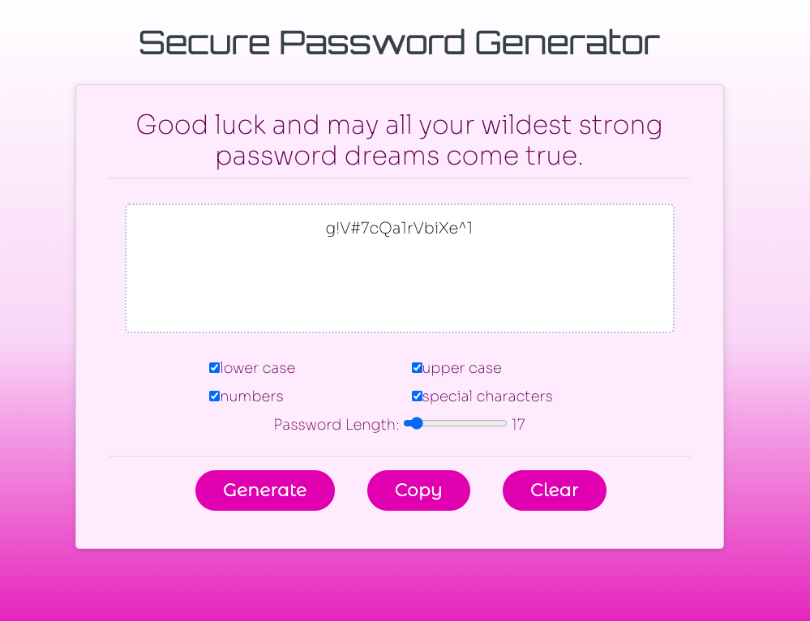

**pushing generate button begins program**

**User chooses number of characters**
1. user is prompted for a number between 8-128, the number of characters allowed in password
1. while loop - if user inputs a value that is less than 8, greater than 128, or is not a number, user will be prompted to input again

**User chooses password characters**
1. characters are organized into 4 separate arrays, with each set to be (or not to be) pushed into a new array depending on what user chooses

**Random character generation**
1. for loop chooses characters at random from new user generated array and based on the number of desired characters
1. random characters generated are placed into a new array
1. .join used so that new password array doesn't appear as separate strings, but as one set of characters that is easy to copy and paste
1. password appears in window above button

**pushing clear button clears window with written password**

